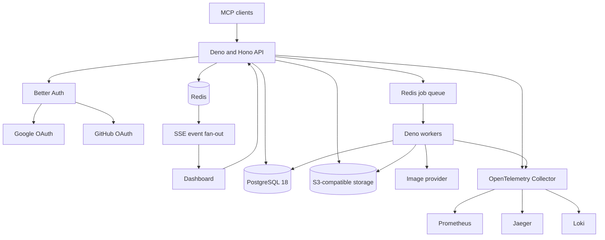
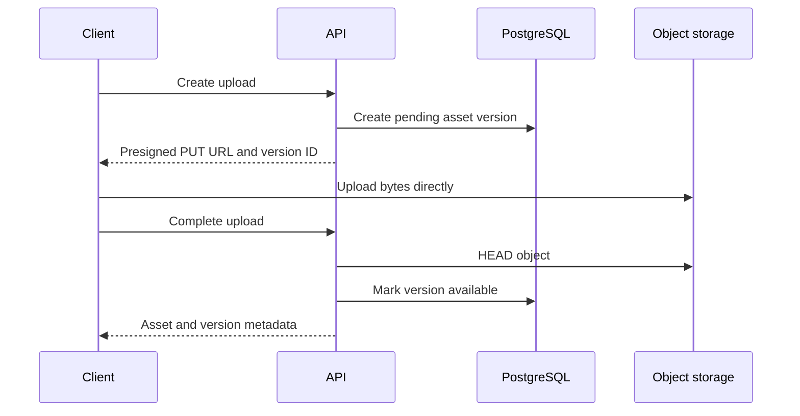

# Project S architecture

Status: agreed MVP architecture\
Working title: Project S\
Planned domain: `https://<project-name>.zaftech.co`

## Product summary

Project S is a multi-tenant storage service exposed through three interfaces:

- A web dashboard for files, jobs, usage, and account management
- A versioned HTTP API
- A remote Model Context Protocol server

The MVP supports direct file upload and download, immutable file versions,
asynchronous jobs, live job updates, and image generation whose output is saved
to S3-compatible storage. General data transformation and streaming are
deliberately postponed, but the design leaves explicit boundaries for them.

## Goals

- Upload files without proxying large payloads through the API
- Return authorized, expiring download URLs
- Track immutable versions of logical assets
- Run long operations outside request handlers
- Show durable status and live progress in the dashboard
- Expose job and storage operations as MCP tools
- Generate images through external providers and save the results
- Support MinIO, AWS S3, Cloudflare R2, and comparable S3 implementations
- Use Google and GitHub for user sign-in
- Act as an OAuth 2.1 authorization server for remote MCP clients
- Preserve workspace isolation from the first release
- Make subscription features and usage limits additive rather than a later
  rewrite
- Produce metrics, traces, and structured logs suitable for the existing
  observability stack
- Deploy as stateless application containers on a VPS

## MVP non-goals

- General-purpose data transformations
- Streaming MCP uploads or downloads
- Multi-region execution
- Kubernetes
- User-defined workflow graphs
- Multiple image providers unless failover is immediately required
- Event sourcing
- Independent microservices for every domain
- Permanent public S3 objects

## Architecture style

Use a modular monolith in one repository and one compiled artifact. The artifact
launches as either an API or worker process:

```text
project-s api
project-s worker
```

The API and worker share contracts and domain code but run independently. This
provides separate scaling and failure boundaries without creating
distributed-service overhead prematurely.



## Technology decisions

| Concern                | Decision                                                                                             |
| ---------------------- | ---------------------------------------------------------------------------------------------------- |
| Runtime                | Deno 2                                                                                               |
| HTTP framework         | Hono                                                                                                 |
| Dashboard              | React and Vite; design work deferred                                                                 |
| MCP                    | Official MCP TypeScript SDK with Streamable HTTP                                                     |
| Authentication         | Better Auth                                                                                          |
| MCP authorization      | Better Auth OAuth 2.1 Provider plugin                                                                |
| Social identity        | Google and GitHub                                                                                    |
| Tenancy                | Better Auth organizations represented as workspaces                                                  |
| Database               | PostgreSQL 18                                                                                        |
| Cache and coordination | Redis                                                                                                |
| Queue                  | Deno/TypeScript queue adapter; BullMQ is the leading implementation pending a compiled-runtime spike |
| Object storage         | S3-compatible provider adapter                                                                       |
| Dashboard updates      | Server-Sent Events with Redis fan-out                                                                |
| Telemetry              | OpenTelemetry through a collector to Prometheus, Jaeger, and Loki                                    |
| Production packaging   | One compiled Deno executable in a container                                                          |

RQ was rejected for the all-Deno worker plan because RQ executes Python function
references in Python worker processes. Deno must not write RQ's private Redis
data structures directly.

## Repository layout

```text
apps/
  api/                 HTTP, auth, MCP, SSE, and dashboard API
  worker/              Queue consumers and job handlers
packages/
  config/              Runtime configuration
  contracts/           Shared public and internal contracts
src/
  main.ts              Process dispatcher compiled into the executable
docs/
  architecture.md
  legal.md
  versioning.md
```

Expected additions as implementation proceeds:

```text
apps/dashboard/        React dashboard
packages/auth/         Better Auth configuration
packages/database/     Schema, queries, and migrations
packages/domain/       Storage, job, entitlement, and usage rules
packages/observability/OpenTelemetry setup
packages/providers/    S3, queue, and image-provider adapters
```

## Infrastructure ownership

PostgreSQL, Redis, MinIO, Prometheus, Loki, Jaeger, and related infrastructure
are deployed independently from the application Compose project. The application
containers are stateless and connect through configuration.

The external services remain the durable infrastructure during application
redeployment. `docker compose down -v` therefore does not remove their
independently managed volumes. It is still unnecessary for routine application
deploys and may remove future application-owned volumes, so the preferred
deployment does not use it.

## API process responsibilities

The API process owns:

- Hono HTTP routing
- Better Auth browser sessions
- Google and GitHub sign-in
- OAuth 2.1 authorization-server endpoints for MCP clients
- OAuth protected-resource metadata
- MCP Streamable HTTP transport
- Workspace authorization
- Entitlement and quota checks
- Presigned upload and download URL creation
- Job submission and durable status queries
- Share-link resolution
- Server-Sent Events for dashboard updates
- Health, readiness, and build-information endpoints

Long-running generation or transformation work must not execute in the API
request lifecycle.

## Worker process responsibilities

Workers own:

- Queue consumption and lease handling
- Job heartbeats
- Retry classification and backoff
- Cooperative cancellation
- Image-provider calls
- Uploading generated results to object storage
- Durable progress and terminal state updates
- Usage reservation settlement
- Cleanup and deletion jobs
- Trace-context continuation

Workers stop accepting new jobs on `SIGTERM`, finish or checkpoint current work
within the configured grace period, and release recoverable leases before
exiting.

Future transformation workers can use separate images containing libvips,
FFmpeg, Python, or other large native dependencies without increasing the API
image.

## Durable ownership of data

### PostgreSQL

PostgreSQL is the durable source of truth for:

- Users, social accounts, browser sessions, OAuth clients, and OAuth consent
- Workspaces, members, roles, and selected workspace
- Logical assets and immutable asset versions
- Job definitions, progress, attempts, and terminal results
- Share links
- Entitlements, subscriptions, and usage events
- Audit events
- Legal document versions and acceptance
- Transactional outbox records when introduced

### Redis

Redis is used for:

- Background queue transport
- Worker coordination and leases
- Rate limiting
- Short-lived cache entries
- Live event fan-out
- Optional distributed locks
- Better Auth secondary storage where appropriate

Redis is not the only source of job status or user-owned metadata.

### S3-compatible storage

Object storage contains bytes. PostgreSQL contains identity, ownership, state,
and metadata.

Configuration must support:

- Endpoint
- Region
- Bucket
- Access key and secret
- Path-style addressing
- TLS behavior
- Presigned URL lifetime
- Optional public or CDN base URL

Provider-specific SDK objects and URLs must not leak into domain contracts.

## Workspaces and authorization

Use Better Auth's organization plugin from the beginning. Expose the product
term `workspace` to users even if Better Auth stores the underlying organization
records.

Every new user receives a personal workspace. Team management, invitations, and
multiple workspaces can remain hidden during the MVP.

Every user-owned domain record must be scoped to a workspace directly or through
a guaranteed parent relationship. Authorization checks use resource ownership
and membership; they do not trust a workspace ID supplied by a client without
verification.

Roles begin with:

```text
owner
admin
member
```

The last owner cannot be removed without transferring ownership.

## Authentication and MCP authorization

Google and GitHub are upstream social identity providers. Better Auth is the
application's session manager and OAuth 2.1 authorization server for MCP
clients.

The deprecated Better Auth MCP plugin must not be used for a new implementation.
Use `@better-auth/oauth-provider` with its MCP resource-server support.

Suggested route layout:

```text
/api/auth/*                                   Better Auth and OAuth provider
/.well-known/oauth-authorization-server/...  Authorization metadata
/.well-known/oauth-protected-resource/...    MCP resource metadata
/mcp                                          Streamable HTTP MCP endpoint
/api/v1/*                                     Dashboard and public HTTP API
```

Suggested protected-resource audience:

```text
https://<project-name>.zaftech.co/mcp
```

Initial OAuth scopes:

```text
openid
profile
email
offline_access
files:read
files:write
jobs:read
jobs:cancel
images:generate
```

MCP access tokens should be JWTs verified locally through JWKS. Each request
validates signature, issuer, audience, expiration, and scopes. Scopes do not
replace workspace membership, resource authorization, entitlement, or quota
checks.

The authorization flow should use the OAuth Provider post-login stage to select
a workspace and collect any required legal acceptance before showing consent.

Google login requests only the minimum identity scopes. Offline Google access is
not requested when Google is only used for sign-in. GitHub is configured with
email access because private email settings may otherwise prevent identity
creation.

Stored provider tokens are encrypted. Account linking is based only on verified
provider data and an explicit linking policy.

Session cookies remain host-only to the product subdomain. Cross-subdomain
cookies for `.zaftech.co` are not enabled unless central login becomes a
deliberate, separately reviewed requirement.

## Upload workflow

The application does not proxy normal uploads.



The create-upload operation accepts optional expected-current-version
information for optimistic concurrency. Completion verifies object existence,
expected size where supplied, and checksum where supported.

An explicit completion request is preferred for the MVP. S3 event notifications
can be added later.

## Download workflow

Authenticated downloads and share links both result in short-lived presigned GET
URLs.

The durable result of a job contains an asset or asset-version ID, never an
expiring URL. The API generates a fresh URL when presenting the result.

Permanent public objects are not used. A future authenticated proxy can be added
for per-byte billing, range-level authorization, or transformations during
download.

## Asset versioning

A logical asset has immutable versions:

```text
assets
  id
  workspace_id
  name
  current_version_id
  created_by
  deleted_at

asset_versions
  id
  asset_id
  sequence
  object_key
  storage_version_id nullable
  sha256
  etag
  size_bytes
  mime_type
  source
  source_job_id nullable
  parent_version_id nullable
  metadata
  created_at
```

Rules:

- Never overwrite an existing object key.
- Enforce a unique `(asset_id, sequence)` constraint.
- Use optimistic concurrency when changing the current version.
- Treat MIME type and original filename as untrusted metadata.
- Record native S3 version IDs when available but do not depend on bucket
  versioning.
- Restore an old version by creating a new head version rather than rewriting
  history.
- Use soft deletion followed by an asynchronous purge workflow.

Example object key:

```text
workspaces/ws_123/assets/asset_456/versions/ver_789/content.png
```

Share links are separate resources with a hashed token, expiration, revocation,
optional download limit, and either a pinned version or follow-current behavior.

## Job model

Initial states:

```text
queued
running
succeeded
failed
cancel_requested
cancelled
```

A job records:

```text
id
workspace_id
type
status
progress
input
result
error_code
error_message
attempt
max_attempts
idempotency_key
input_schema_version
handler_version
created_by_app_version
queued_at
started_at
heartbeat_at
finished_at
created_by
```

Progress is structured:

```json
{
  "current": 2,
  "total": 4,
  "percentage": 50,
  "stage": "uploading_result",
  "message": "Saving generated image"
}
```

Queue delivery is treated as at least once. Every handler must therefore be
idempotent or guarded by an idempotency key and durable state transition.

Reliability requirements:

- Heartbeat long-running work.
- Recover or fail stale leases.
- Retry only classified transient errors.
- Use exponential backoff with jitter.
- Apply hard execution timeouts.
- Make cancellation cooperative.
- Sanitize client-facing errors.
- Preserve detailed failures in logs and traces.
- Retain terminal job metadata after queue result expiry.

The leading queue implementation is BullMQ because Redis is already available
and both API and workers use TypeScript. Before adoption, a spike must prove
enqueue, consume, retry, cancellation, graceful shutdown, and `deno compile`
compatibility. Queue types remain behind a domain adapter.

## Live dashboard updates

Use Server-Sent Events for the MVP because updates are predominantly
server-to-client.

Dashboard behavior:

1. Fetch the durable current state over HTTP.
2. Open one workspace-scoped SSE connection.
3. Receive compact invalidation or update events.
4. Refetch affected data when needed.
5. On reconnect, reload durable state from PostgreSQL.

Redis Pub/Sub may fan events across API processes, but it is not durable.
Missing an event is harmless because the reconnect path reads PostgreSQL.

A transactional outbox should be introduced when event delivery must coordinate
strictly with database commits. The MVP may update PostgreSQL first and publish
best-effort live events second.

WebSockets are deferred until bidirectional streaming or high-frequency
interactive control is required.

## MCP tools

Initial tool groups:

```text
files.create_upload
files.complete_upload
files.get
files.list
files.list_versions
files.create_download_url
files.delete

jobs.get
jobs.list
jobs.cancel

images.generate
```

`images.generate` enqueues work and returns immediately with a job ID and
status. `jobs.get` returns durable result asset IDs and may include newly
generated download URLs in the response presentation.

Tool contracts should remain coarse-grained and stable. Add optional fields
compatibly; create a suffixed replacement only for unavoidable breaking changes.

## Entitlements, subscriptions, and usage

Feature flags, entitlements, and metered usage are separate concepts.

### Feature flags

Feature flags control operational rollout, for example:

```text
new_upload_flow
streaming_beta
new_image_provider
```

They do not imply payment rights.

### Entitlements

Entitlements express allowed capabilities and limits:

```text
files.versioning
images.generate
transformations.execute
streaming.upload
storage.max_bytes
storage.max_file_size
storage.max_versions
jobs.max_concurrent
```

Application code asks an entitlement service rather than checking plan names:

```text
can(workspace, feature)
limit(workspace, metric)
```

### Usage

Metered usage begins with an append-only ledger:

```text
storage.bytes
egress.bytes
images.generated
image_provider.cost_units
transformations.minutes
api.requests
```

Suggested billing tables:

```text
billing_customers
subscriptions
entitlement_grants
usage_events
usage_reservations
usage_buckets
```

Every usage event has a unique idempotency key.

Async jobs use reservation accounting:

1. Verify the feature entitlement.
2. Reserve estimated capacity.
3. Enqueue the job.
4. Commit actual usage on success.
5. Release unused capacity on failure or cancellation.

This prevents concurrent jobs from all passing the same remaining-quota check.

Plans are billing-provider-neutral. Paddle is the expected initial Merchant of
Record based on ZafTech's current legal documents, but Paddle statuses are
mapped into internal subscription states.

Plan definitions require historical identity. A later change to a plan named
`pro` must not silently rewrite the entitlements that applied to an older
subscription period.

## Initial data model areas

Expected tables are grouped by domain:

### Better Auth

```text
user
account
session
verification
oauth_client
oauth_access_token
oauth_refresh_token
oauth_consent
organization
member
invitation
```

Actual names follow the selected Better Auth adapter and generated schema.

### Storage

```text
assets
asset_versions
share_links
```

A content-addressed `blobs` table may be added later if cross-version
deduplication becomes valuable.

### Jobs

```text
jobs
job_attempts
outbox_events
```

### Commercial controls

```text
billing_customers
subscriptions
entitlement_grants
usage_events
usage_reservations
usage_buckets
```

### Governance

```text
audit_events
legal_documents
legal_acceptances
```

## Provider boundaries

Provider interfaces use domain types rather than vendor SDK types:

```text
ObjectStorage
  createUploadUrl
  createDownloadUrl
  headObject
  deleteObject
  putObject

JobQueue
  enqueue
  consume
  retry
  cancel

ImageGenerator
  generate
  getStatus
  cancel
```

Only create abstractions around actual boundaries. Do not implement hypothetical
adapters before the first provider works.

Image-provider responses are normalized into an internal result model.
Provider-specific options may live in a controlled `providerOptions` field
without becoming top-level domain fields.

## Observability

Both API and workers emit OpenTelemetry data to a collector. The collector
routes data to the independently deployed backends.

### Metrics

Initial low-cardinality metrics:

- HTTP and MCP request count, latency, and errors
- Queue depth and oldest queued-job age
- Job duration, failures, retries, and cancellations by job type
- Active workers and stale heartbeats
- Uploaded, stored, downloaded, and generated bytes
- S3 request latency and errors
- Image-provider latency, errors, and cost units
- SSE connection count and reconnects
- Entitlement denials and quota exhaustion by metric

Do not use job IDs, file IDs, user IDs, prompts, or object keys as Prometheus
labels.

### Traces

Trace context propagates through queue messages:

```text
MCP or HTTP request
  -> PostgreSQL transaction
  -> queue enqueue
  -> worker consume
  -> image provider
  -> S3 upload
  -> PostgreSQL completion
```

Better Auth's OpenTelemetry instrumentation is currently experimental. It may be
enabled behind a local wrapper and pinned version, but the application must not
depend on an unstable span shape for correctness.

### Logs

Emit structured JSON with fields such as:

```text
service
environment
app_version
revision
trace_id
span_id
workspace_id
job_id
job_type
provider
error_code
```

Do not log credentials, bearer tokens, signed URLs, file contents, or full
prompts by default.

## Security baseline

- Use HTTPS for every production endpoint.
- Use a high-entropy Better Auth secret of at least 32 characters.
- Keep Better Auth CSRF and origin checks enabled.
- Configure only exact trusted origins.
- Force secure, HTTP-only cookies in production.
- Configure trusted proxy headers only for the actual reverse proxy.
- Encrypt social OAuth tokens at rest.
- Hash API keys, share tokens, and OAuth client secrets where applicable.
- Keep `testUtils` in a separate test-only auth configuration.
- Rate-limit auth, OAuth registration, MCP tools, URL creation, and expensive
  jobs.
- Use short-lived presigned URLs.
- Generate object keys server-side.
- Enforce file-size, workspace-storage, egress, and concurrency limits.
- Validate checksums when practical.
- Treat content type and file extension as untrusted.
- Restrict worker egress or allowlist remote fetch sources when URL ingestion is
  added.
- Audit key creation, key revocation, file deletion, share-link creation, role
  changes, and billing changes.
- Scope every query and mutation to an authorized workspace.
- Avoid exposing provider or internal error details to clients.

## Legal integration

Company-wide terms, privacy, refund, cookie, and acceptable-use pages remain
canonical on `zaftech.co`. Product legal routes redirect to them rather than
copying content.

The new product needs a reviewed addendum covering stored files, version
history, sharing, retention, quotas, AI prompts and output, image-provider
subprocessors, abuse handling, and consumed-usage refunds.

Store accepted legal document version and content hash. See `legal.md` for the
verified URLs and identified changes.

## CI and deployment

### Pull requests to `main`

CI should run:

```text
format check
lint
type check
unit tests
integration tests with disposable dependencies
compiled-runtime smoke test
container build
security and dependency scanning
```

Better Auth test utilities remain test-only.

### Merge to `main`

CD builds the application image once and publishes:

```text
immutable Git SHA tag
main tag
latest tag if desired
release tag when a release is created
```

The exact SemVer and release-tag policy remains under discussion in
`versioning.md`.

### VPS deployment

Preferred application deployment:

```sh
docker compose pull
docker compose run --rm migrate
docker compose up -d --remove-orphans
```

The migration process is a one-shot command or image using reviewed migrations.
Do not run development schema-push commands against production.

`docker compose down -v` does not affect the independently deployed
infrastructure described here, but it is unnecessary for routine application
updates and creates downtime.

Production should pin an immutable image or release tag to make rollback
deterministic.

## Health and build endpoints

The initial scaffold exposes:

```text
GET /health/live
GET /health/ready
GET /version
GET /api/v1
```

Liveness only proves that the process can respond. Readiness will later check
required dependencies without performing destructive operations.

Build information is included in health responses, logs, traces, MCP server
information, and dashboard diagnostics. The exact SemVer source is pending
approval.

## Delivery phases

### Foundation

- Deno workspace and compiled process dispatcher
- Hono API shell
- Configuration and validation
- Database migrations
- Structured logging and OpenTelemetry bootstrap
- Container and CI pipeline

### Identity and tenancy

- Better Auth with Google and GitHub
- Organization/workspace plugin
- OAuth 2.1 Provider and MCP resource metadata
- Legal acceptance and workspace selection

### Storage

- S3 adapter
- Asset and asset-version schema
- Presigned upload, completion, download, and deletion
- Storage usage accounting

### Jobs

- Queue compatibility spike and adapter
- Durable jobs, attempts, heartbeat, retries, and cancellation
- SSE live updates
- Usage reservations

### Image generation

- First image provider
- Generated-output storage
- Provider usage and cost accounting
- MCP tools and dashboard status

### Later

- General transformations
- Capability-specific worker images
- Streaming
- Additional providers
- Advanced share policies
- Team management and paid subscriptions

## Open decisions

The following are intentionally unresolved:

- Final product name and domain
- Dashboard component and styling system
- Exact database query layer and migration tool
- BullMQ compile compatibility and final queue selection
- First image-generation provider
- Paddle integration timing
- Storage-version retention defaults
- Initial plan catalog and quota values
- Product SemVer and release automation policy
- Public compatibility and deprecation window for MCP tools
