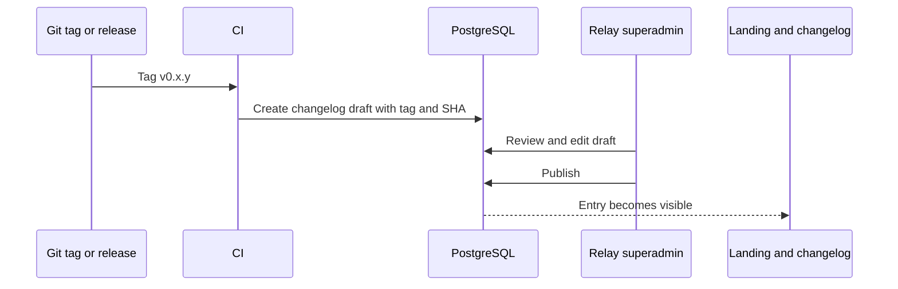

# Relay changelog architecture

Status: recommended design; implementation deferred until identity, database,
and superadmin authorization exist

## Decision

Use a **Git-assisted, database-published changelog**.

Git identifies the exact release source. PostgreSQL controls what is publicly
published. A Relay superadmin reviews and publishes each entry.

Do not render raw Git commit messages directly to customers. Commits are
implementation history, not product communication, and frequently contain
internal detail, partial work, or language that is meaningless outside the
repository.

Do not make the production application write Markdown back into the repository
through a broad GitHub token. That couples publication to source-control
permissions and creates an unnecessary secret with write access.

## Publication flow



### Release creation

1. A release tag such as `v0.3.0` is created.
2. CI builds and publishes the immutable application image.
3. CI calls an authenticated internal endpoint or one-shot command to create a
   changelog draft.
4. The draft stores the version, Git tag, full commit SHA, release time, and
   optional generated candidate notes.
5. The superadmin edits user-facing copy and previews the result.
6. Publishing records the publisher and publication time in one database
   transaction.
7. `/changelog`, the landing-page preview, RSS/Atom, and the public JSON
   endpoint read only published entries.

For the MVP, step 3 may be manual: the superadmin creates a draft and pastes the
tag and SHA. Automation can be added after the release process is stable.

## Content sources

Candidate release notes can be assembled from:

- Pull-request titles and labels
- Explicit changelog fragments committed with a pull request
- A manually written GitHub Release draft
- Superadmin-authored content

Recommended long-term contribution format:

```text
changes/
  1234.added.md
  1235.fixed.md
  1236.security.md
```

Each fragment should contain a user-facing sentence and optional metadata.
Release CI can consume the fragments into a draft, but the database publication
gate remains authoritative.

A fragments workflow is preferable to parsing every commit because the author
decides whether a change is notable when the context is fresh.

## Roles

Initial publication permission:

```text
system role: superadmin
permission: changelog:publish
```

`superadmin` is a system-level role and must not be represented as a normal
workspace role. Workspace owners manage their own Relay resources; they cannot
publish global product changes.

Suggested permissions:

```text
changelog:read_drafts
changelog:create
changelog:update
changelog:publish
changelog:unpublish
```

Only the superadmin receives these permissions initially.

## Data model

```text
changelog_releases
  id
  version
  slug
  title
  summary
  status              draft | published | archived
  git_tag
  commit_sha
  released_at
  published_at
  published_by
  created_at
  updated_at

changelog_items
  id
  release_id
  category            added | improved | fixed | security | breaking
  area
  title
  description
  sort_order
  created_at
  updated_at

changelog_revisions
  id
  release_id
  revision
  snapshot
  changed_by
  changed_at
```

Constraints:

- `version` is unique for release entries.
- `slug` is unique and stable after publication.
- `git_tag` and `commit_sha` identify the source build.
- Publishing requires at least one item and a valid release version.
- Published entries are changed through a new audited revision, not silent
  mutation.
- Security entries can be held privately until disclosure is safe.

## API and routes

Public:

```text
GET /api/v1/changelog
GET /api/v1/changelog/:slug
GET /changelog
GET /changelog/:slug
GET /changelog/feed.xml
```

Superadmin:

```text
GET    /api/v1/admin/changelog
POST   /api/v1/admin/changelog
PATCH  /api/v1/admin/changelog/:id
POST   /api/v1/admin/changelog/:id/publish
POST   /api/v1/admin/changelog/:id/unpublish
```

Public endpoints return published entries only. Draft endpoints require a fresh
authenticated superadmin session and produce audit events.

## Landing-page integration

The landing page shows the latest two or three published releases:

- Version
- Date
- One-line title
- Category summary
- Link to the full entry

If nothing has been published, omit the section rather than rendering fake
release data.

The Stitch design may use clearly labelled illustrative entries to establish
layout, but production must not claim those entries are real.

## Version relationship

The product SemVer is the release identity. The changelog does not create
another release number.

Independent versions remain independent:

- App release: `0.3.0`
- Changelog revision: internal monotonic revision
- HTTP API: `/api/v1`
- MCP tool schema: contract-specific compatibility
- Database migration: migration identifier
- Asset version: per-asset immutable version

Correcting a typo in a published changelog entry creates a changelog revision
but does not create a new product release.

## Notifications

After the base flow works, publication may emit:

- RSS/Atom feed update
- Dashboard “What’s new” notification
- Email to opted-in users
- Optional MCP resource or tool for recent changes

These consume a `changelog.published` outbox event. They do not run inside the
publication transaction.

## Audit and rollback

Every publish, unpublish, and edit records:

- Actor
- Timestamp
- Previous snapshot
- New snapshot
- Request trace ID

Unpublishing hides an entry but does not delete its audit history. A release
linked to an actually deployed image should normally be corrected or annotated
rather than erased.
