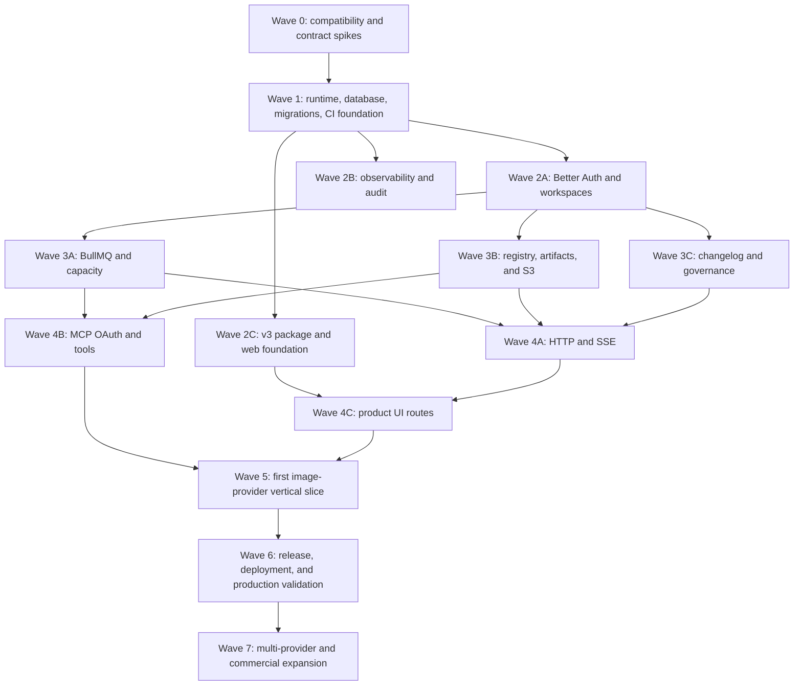

# Execution waves and parallel work

Status: ordered implementation plan\
Rule: no lane starts until its declared inputs are merged and its owning paths
are available

## Overall dependency graph



## Shared ownership rules

The following have one owner at a time:

- Database migration manifest and generated database types
- Public IDs and domain contracts
- Root import map and lock file
- Application command dispatcher
- Web app entry point, router, token layer, and shared primitives
- Production Compose and release workflows

Parallel lanes propose contract changes through the owning lane instead of
editing these files independently.

Every lane uses a dedicated branch/worktree. Suggested names are illustrative;
an orchestrator may use equivalent names while keeping write scopes disjoint.

## Wave 0 — compatibility and contract spikes

Goal: remove runtime uncertainty before permanent dependencies or schemas land.

All lanes may run in parallel from the same clean `main`.

| Lane              | Suggested branch                    | Output                                                                              | Required proof                                                                                  |
| ----------------- | ----------------------------------- | ----------------------------------------------------------------------------------- | ----------------------------------------------------------------------------------------------- |
| Runtime/container | `impl/00-runtime-spike`             | Corrected experimental Dockerfile outside production path or disposable spike files | Compiled API/worker starts in source-free Linux image with only intended permissions            |
| Database/auth     | `impl/00-auth-db-spike`             | Disposable Better Auth + `pg` + Kysely probe                                        | PostgreSQL 18 migration generation, connection, auth health, compiled execution, clean shutdown |
| BullMQ            | `impl/00-bullmq-spike`              | Disposable queue probe                                                              | Live enqueue/consume/delay/retry/cancel/stall/reconnect/SIGTERM in compiled Linux image         |
| Storage           | `impl/00-s3-spike`                  | Disposable AWS SDK and Deno-native adapter comparison                               | MinIO presign/PUT/HEAD/GET/delete/checksum/expiry from compiled image                           |
| MCP               | `impl/00-mcp-spike`                 | Disposable SDK v2/Hono endpoint                                                     | Official client/conformance, Origin/Host rejection, compiled Deno execution                     |
| Telemetry         | `impl/00-otel-spike`                | Disposable Deno native OTel probe                                                   | API span, custom metric, correlated log reach Alloy and all selected backends                   |
| v3 reconciliation | `design/03-implementation-contract` | Design manifest/decision report only                                                | Owner records exact v3 commit, precedence, routes, missing assets, and approved fixture policy  |

Spikes do not create production abstractions. They answer pass/fail questions,
record binary size and permissions, and are removed or isolated before
production work.

### Wave 0 gate

- Selected versions are exact and recorded.
- `deno.lock` is reproducible with frozen mode.
- Backend compiles and runs in Linux without Node installed.
- No selected dependency requires unjustified `--allow-run`, broad
  `--allow-read`, or `--allow-ffi`.
- BullMQ and Better Auth operate against real disposable Redis/PostgreSQL.
- Storage adapter is selected through the same MinIO contract suite.
- MCP package/protocol and OAuth-provider path are recorded.
- Telemetry backend choice is recorded: Tempo or a remediated persistent Jaeger.
- v3 path and owner approval are resolved before UI production work.

A failed spike blocks only dependent lanes. For example, UI token extraction may
continue while BullMQ compatibility is unresolved.

## Wave 1 — runtime, database, and delivery foundation

One integration owner establishes shared contracts first:

```text
packages/config/
packages/contracts/
packages/database/
src/main.ts
Dockerfile
deploy/ or compose production skeleton
```

Then these lanes may run in parallel:

### Lane 1A — runtime and configuration

- Fail-fast typed configuration
- API/worker/migrate/healthcheck commands
- Graceful shutdown coordinator
- Correct build metadata
- Source-scoped quality tasks
- Backend image

### Lane 1B — migrations and database

- Pool and Kysely setup
- Checksummed migration manifest
- Advisory lock and migration ledger
- Runtime/migrator roles
- Fresh/status/repeat/compatibility commands

### Lane 1C — CI foundation

- PR source checks
- Disposable dependency services
- Backend compile/container smoke
- Stable aggregate required check
- Secret/dependency/config scanning

### Lane 1D — telemetry bootstrap

- Deno native OTel environment contract
- Manual instrumentation wrapper
- Sanitized logger
- Alloy development receiver/test fixture
- Initial metrics and trace-context helpers

### Wave 1 gate

- Fresh database migrates once; second run is a no-op.
- Modified historical migration fails before DDL.
- API and worker start from compiled backend image.
- `SIGTERM` closes server, pool, and telemetry within grace period.
- Readiness reports dependency and migration state accurately.
- PR CI can run the same commands locally.
- Telemetry outage does not fail application requests.

## Wave 2 — identity, observability, and web foundation

These lanes are parallel after Wave 1 shared infrastructure lands.

### Lane 2A — Better Auth and workspaces

Owned paths:

```text
packages/auth/
apps/api/src/routes/auth/
auth-related migrations and tests
```

Deliver Google/GitHub-only auth, personal workspace provisioning, session
middleware, organization roles, system superadmin grants, and auth audit events.

### Lane 2B — observability and audit

Owned paths:

```text
packages/observability/
packages/audit/
observability tests and deployment templates
```

Deliver domain metrics/spans, redaction, durable audit service, Alloy templates,
dashboards, and alerts without waiting for every domain feature.

### Lane 2C — v3 package and web foundation

Blocked until v3 is committed and approved. Owned paths:

```text
apps/web/
apps/web/src/styles/
apps/web/src/components/ui/
apps/web/src/components/brand/
apps/web/src/components/layout/
apps/web/src/lib/
```

Deliver React/Vite scaffold, router, session client, design tokens, fonts,
approved copied assets, shared primitives, layouts, browser-test harness, and
fixture boundary. Do not implement all product routes in this lane.

### Wave 2 gate

- OAuth-only session integration tests pass without live provider calls.
- First sign-in creates exactly one personal workspace and owner membership.
- Workspace and system roles cannot cross privilege boundaries.
- Audit records are durable and immutable by normal application code.
- A trace correlates HTTP, database, log, and audit identifiers safely.
- Web foundation builds without importing design runtime/canvas files or remote
  fonts/scripts.

## Wave 3 — execution, resources, and governance

After Wave 2 auth/database contracts merge, three substantial lanes can proceed
in parallel. Database migration ownership remains centralized.

### Lane 3A — BullMQ, capacity, and fairness

- Transactional outbox relay
- BullMQ adapter and shallow capacity-pool queues
- Worker fenced claims and heartbeats
- GCRA/token bucket and leased concurrency scripts
- Queue depth/age policy
- Cancellation and retry classification
- Weighted fair scheduler with standard/paid/enterprise/internal classes

### Lane 3B — registry, storage, artifacts, and metering

- Tool/tool-version/provider/model catalog
- S3 adapter and direct upload completion
- Artifact/version/output-set model
- Share links and managed delivery
- Entitlement interface
- Estimate/reservation/usage/provider-cost ledgers

This lane may split after shared schema merges:

- `3B-storage`: storage and artifacts
- `3B-catalog`: registry/provider metadata
- `3B-metering`: reservations and ledgers

### Lane 3C — changelog and governance

- Superadmin authorization
- Changelog draft/edit/publish/revision flow
- Legal document and acceptance records
- Governance audit integration

### Wave 3 gate

- Multiple workers cannot exceed global or workspace limits.
- Weighted fairness converges under saturation without starving any positive
  class.
- Accepted jobs survive Redis/process failures through outbox reconciliation.
- MinIO contract tests pass.
- Cross-workspace storage, catalog, usage, and governance access is denied.
- Usage reservations cannot overspend concurrently.
- Only published changelog entries are public.

## Wave 4 — interfaces and product routes

### Lane 4A — HTTP and dashboard SSE

- Versioned HTTP resources
- Idempotency middleware
- Structured errors
- Run status/cancellation
- Workspace-scoped SSE with reconnect/resync
- Share resolver and short-lived download redirect

### Lane 4B — MCP and OAuth resource server

- Better Auth direct OAuth Provider
- Protected-resource and authorization-server metadata
- MCP SDK v2 Streamable HTTP endpoint
- Typed management tools
- Active catalog tool registration
- Scope, audience, current-membership, and entitlement enforcement

### Lane 4C — web route group one

After shared web foundation and API contracts:

Parallel worktrees:

- Landing + public shell
- Sign-in and auth states
- Protected dashboard overview

These three merge and pass browser tests before deeper product routes.

### Lane 4D — web route group two

After shared tool/run/artifact contracts:

Parallel worktrees:

- Tool catalog/detail/composer shell
- Runs/list/detail/SSE states
- Artifact gallery/detail/share
- Usage/settings/profile
- Changelog/docs/status
- Superadmin registry/providers/changelog

### Wave 4 gate

- HTTP and MCP use the same application services and policy decisions.
- MCP conformance and OAuth negative tests pass.
- SSE disconnect/reconnect cannot lose durable state.
- Landing/auth/dashboard browser gate passes at required viewports.
- No raw fixture value is presented as a production fact.

## Wave 5 — first image-provider vertical slice

This wave begins only after the owner selects a real provider/model and meter
policy.

Parallel preparation:

- Provider adapter and recorded/sandbox contract tests
- Provider-specific schema extension
- Licensed output fixtures and design replacement assets
- Cost normalization and settlement policy

Then integrate serially:

```text
tool publication
  -> HTTP/MCP invocation
  -> reservation
  -> fair queue
  -> provider submission/recovery
  -> output ingestion
  -> artifact/share URL
  -> settlement
  -> dashboard updates
```

### Wave 5 gate

- End-to-end HTTP and MCP image generation succeeds.
- Multi-output and partial-output behavior is tested.
- Ambiguous submission cannot duplicate provider work.
- Provider/storage failure does not lose accepted state.
- Estimate and final receipt reconcile under approved policy.
- No prompt, provider token, signed URL, or content leaks to telemetry.
- Browser golden path passes keyboard, screen-reader, mobile, and visual checks.

## Wave 6 — release and production validation

Parallel lanes after release policy is approved:

- Protected-main/ruleset configuration
- Release Please and Conventional Commit/PR-title policy
- Backend/web image workflows
- Production Compose/Nginx templates
- Grafana dashboards/alerts and telemetry backend remediation
- Backup, migration, deploy, rollback, and incident runbooks

Integration is serial:

1. Release PR
2. Version/tag creation
3. Build, scan, SBOM, provenance, image publication
4. Digest manifest
5. Manual VPS pull/migrate/up
6. Production smoke and rollback rehearsal
7. Customer changelog draft and superadmin publication

### Wave 6 gate

- Protected branch rejects direct/failed changes.
- Tag builds both images from the same SHA/version.
- Deployment uses digest-pinned images and no application-owned destructive
  volume operation.
- Expand-only schema supports previous-image rollback.
- Telemetry, alerts, backup, restore, and notification delivery are exercised.

## Wave 7 — future expansion

Parallel future work can include:

- Additional providers/models
- Billing and subscription adapters
- Scheduling-weight assignment for paid and enterprise tiers
- Team/invitation UI
- Provider routing and explicit fallback
- Streaming
- Native-dependency worker images
- Multi-region capacity allocation

These reuse the interfaces and policy revisions created earlier; they do not
replace workspace authorization, durable execution, or usage ledgers.

## Merge protocol

For every wave:

1. Rebase worktrees on the wave baseline before review.
2. Merge shared contracts/migrations first.
3. Rebase dependent lanes after contract merge.
4. Merge independent implementation lanes one at a time.
5. Run targeted tests after each merge.
6. Run the full wave gate after the final lane.
7. Record failures not caused by the wave; do not hide or rewrite unrelated
   work.
8. Tag no release until release automation and version policy are approved.
