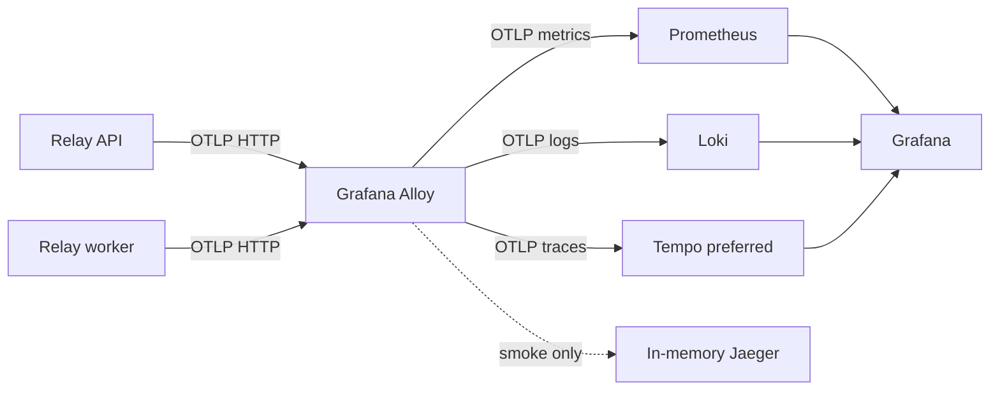

# Observability and durable audit

Phase: Wave 1D foundation, expanded in Waves 2B–6\
Primary owner: observability/audit worktree\
Depends on: stable process/config contracts\
Must not block application availability when telemetry is unavailable

## Objective

Instrument API, worker, queue, database, storage, provider, metering, and
release behavior with correlated traces, metrics, and sanitized logs, while
keeping security/governance audit events as durable PostgreSQL records.

## Selected topology



Relay sends all application signals only to Alloy. Alloy handles filtering,
batching, retry, and backend routing. Do not configure three independent
application exporters.

## Deno native OpenTelemetry

Use Deno's built-in provider:

```text
OTEL_DENO=true
OTEL_EXPORTER_OTLP_PROTOCOL=http/protobuf
OTEL_EXPORTER_OTLP_ENDPOINT=http://alloy:4318
OTEL_SERVICE_NAME=relay-api or relay-worker
OTEL_RESOURCE_ATTRIBUTES=service.namespace=relay,deployment.environment.name=production,service.version=<version>,relay.build.revision=<sha>,service.instance.id=<id>
OTEL_PROPAGATORS=tracecontext
OTEL_DENO_CONSOLE=capture
OTEL_METRIC_EXPORT_INTERVAL=15000
```

Import only:

```text
npm:@opentelemetry/api@1
```

Do not initialize `NodeSDK`, a second provider, or application-side exporters.
Deno automatically instruments `Deno.serve`, `fetch`, runtime metrics, and
console logs.

### Required application enrichment

Deno's auto server span lacks Hono route templates. Middleware must:

- Set `http.route` to the matched template
- Rename span to `METHOD /templated/path`
- Set normalized ERROR status and sanitized exception event
- Never use raw IDs or tokens in span names
- Record route-level custom metrics because native HTTP metrics lack route
- Treat SSE auto span as handshake only; record connection lifetime separately

Manual spans cover PostgreSQL, Redis, BullMQ, S3, provider submission/retrieval,
authorization, reservation, settlement, outbox, and reconciliation.

## Trace propagation through BullMQ

Use the global OTel API to inject W3C trace context when creating a ticket and
extract it in the worker. Allow only `traceparent` and `tracestate`; omit
baggage because queue metadata persists in Redis.

If `bullmq-otel` is used, wrap its Telemetry interface. Do not export raw BullMQ
attributes that may include job IDs, options, results, progress, failure
reasons, worker IDs, or serialized payloads.

Allowed bounded attributes include:

```text
queue.name
job.handler
job.state
attempt.number
operation
outcome
error.type
provider
model
```

Set failed worker spans to ERROR explicitly. Document whether consumer spans use
the producer as parent or link; remain consistent across retries.

## Trace model

```text
HTTP or MCP request
  -> authenticate/authorize
  -> entitlement and estimate
  -> reservation transaction
  -> outbox publication
  -> BullMQ producer
  -> worker claim/attempt
  -> capacity permit
  -> provider submit/inspect/retrieve
  -> object storage
  -> artifact transaction
  -> usage settlement
  -> SSE/outbox event
```

A run may span minutes. Do not assume tail sampling can wait long enough for
late worker failure. Use deterministic parent-based head sampling after initial
acceptance testing.

Initial low-volume acceptance:

```text
OTEL_TRACES_SAMPLER=always_on
```

Later:

```text
OTEL_TRACES_SAMPLER=parentbased_traceidratio
OTEL_TRACES_SAMPLER_ARG=<approved ratio>
```

Metrics and operational errors remain complete regardless of trace sampling.

## Metrics

Initial Relay instruments:

```text
relay.http.server.request.duration
relay.auth.outcomes
relay.queue.depth
relay.queue.oldest_age
relay.queue.admission_rejections
relay.queue.deferrals
relay.job.attempt.duration
relay.job.attempts
relay.job.retries
relay.job.stalls
relay.job.cancellations
relay.worker.heartbeats
relay.capacity.active
relay.capacity.wait.duration
relay.capacity.rate_denials
relay.provider.operation.duration
relay.provider.outcomes
relay.provider.cooldown
relay.storage.operation.duration
relay.storage.bytes
relay.artifact.outcomes
relay.usage.reservation.outcomes
relay.usage.settlement.lag
relay.sse.connections
relay.sse.reconnects
relay.outbox.pending
relay.outbox.oldest_age
```

Allowed labels are bounded enums or catalog values with controlled cardinality:
route template, method, status class, operation, outcome, fixed queue/handler,
tool key/version, allow-listed provider/model, scheduling class, and normalized
error type.

Never use user/workspace/request/run/job/artifact/session IDs, URLs, object
keys, prompts, or arbitrary error messages as metric labels.

OTLP push does not create Prometheus's scrape `up` for Relay. Add external HTTP
probing plus explicit worker heartbeat and backend health metrics.

## Logs

Use a shared application logger that emits a fixed JSON schema to console. Deno
`OTEL_DENO_CONSOLE=capture` preserves stdout and exports correlated OTel logs.

Do not also scrape the same container stdout into Loki, or logs will be
duplicated. Keep Docker JSON log rotation for break-glass local inspection.

Schema examples:

```text
event.name
severity
message
operation
outcome
error.type
http.route
tool.key
tool.version
provider
model
attempt.number
queue.reason
```

High-cardinality IDs may be structured metadata only where policy permits and
must never become Loki index labels.

Redact before logging and again in Alloy:

- Authorization, API keys, cookies, OAuth codes/state/tokens
- Query strings and raw full URLs
- Signed URLs and object keys
- Prompts, file contents, provider payloads/results
- SQL parameters/query values
- BullMQ options/results/progress/failure strings
- Arbitrary request/response bodies

Raw `error.message` and `error.stack` are unsafe by default. Normalize error
type, use a safe message, and include protected stack information only under an
explicit operator policy.

## Alloy pipeline

Conceptual order:

```text
otelcol.receiver.otlp
  -> memory_limiter
  -> transform/redaction
  -> filter
  -> batch
  -> separate metrics/logs/traces exporters
```

Requirements:

- Bind receivers only to the private Docker network.
- Enable OTLP HTTP 4318; optional private gRPC 4317 for telemetrygen tests.
- Use bounded request size, memory limiter, queue, and retry.
- Keep backend queues independent so one outage does not block other signals.
- Prefer dropping telemetry over applying backpressure to Relay.
- Scrape Alloy's own metrics and alert on refusal/export/queue saturation.
- Do not use debug exporter in production.
- Persistent OTel queues require a currently preview Alloy component; decide
  explicitly whether preview is acceptable.

Exact Alloy syntax is deferred until the live `alloy-config.river` and image
version are supplied. See [`10-vps-remediation.md`](10-vps-remediation.md).

## Backend routing

### Prometheus

Use its enabled native OTLP receiver through Alloy:

```text
http://prometheus:9090/api/v1/otlp/v1/metrics
```

Add out-of-order ingestion tolerance for batched collectors and a conservative
resource-attribute promotion list. Do not send duplicate metrics through both
OTLP and remote write.

### Loki

Use:

```text
http://loki:3100/otlp/v1/logs
```

Keep only service/environment/namespace as index labels. Instance ID, version,
revision, trace/span IDs, and application IDs remain structured metadata. Alert
on discarded samples and structured-metadata limit failures.

### Traces

Prefer Tempo after auditing its actual version/config/storage. The supplied
Jaeger all-in-one is memory-backed and loses traces on restart, so it is
suitable only for smoke tests.

Do not permanently fan every trace to both Tempo and Jaeger.

## Durable audit events

Audit is not a log stream. Store in PostgreSQL:

```text
relay.audit_events
  id
  occurred_at
  actor_type
  actor_user_id nullable
  oauth_client_id nullable
  workspace_id nullable
  action
  target_type
  target_id nullable
  outcome
  reason_code nullable
  before_snapshot jsonb nullable
  after_snapshot jsonb nullable
  request_id nullable
  trace_id nullable
  ip_hash_or_policy_value nullable
  user_agent_summary nullable
```

Audit actions include:

- Auth session/account link/revoke
- Workspace/member/role changes
- System-superadmin grants
- Tool publish/disable/deprecate/retire
- Provider routing/credential-state changes
- Share-link creation/revocation
- Artifact deletion/purge/restore
- Entitlement/scheduling/meter policy changes
- Changelog publish/unpublish
- Billing/subscription changes later

Normal application roles cannot update/delete audit rows. Corrections append new
events. Snapshots are bounded and redact secrets/content.

## Dashboards

Provision or document:

1. Relay overview: availability, rate, errors, latency, readiness, release.
2. Execution: depth, oldest age, throughput, attempts, failures, stalls,
   cancellations, capacity, worker heartbeat.
3. Provider/storage: latency, rate limits, cooldown, cost units, S3 outcomes.
4. Usage: reservation denials, settlement lag, reconciliation.
5. Telemetry pipeline: Alloy accepted/refused/exported, queue saturation,
   backend errors.
6. Backend health: Prometheus TSDB, Loki ingestion/query, Tempo storage/query,
   VPS/container resources.
7. Release comparison by bounded service version.

Use stable datasource UIDs and version-controlled provisioning where possible.
Do not overwrite existing Grafana alerts without exporting/reviewing them first.

## Alerts

Initial categories; thresholds are selected from observed baselines/SLOs:

- External API unavailable
- Required readiness dependency failure
- Fast/slow error-budget burn
- Route latency breach
- Worker heartbeat missing
- Queue depth/oldest age breach
- Job failure/retry/stall/cancellation spike
- Provider error/rate-limit/cooldown spike
- PostgreSQL/Redis/S3 errors
- Usage settlement/outbox reconciliation lag
- Alloy refused/dropped/export failures or queue saturation
- Loki discarded samples
- Tempo ingestion/storage/query/compaction failures
- Prometheus/Loki/Tempo disk or memory pressure
- Unexpected absence of application telemetry
- Notification delivery failure

Prometheus rule evaluation alone is not notification routing. Confirm whether
Grafana-managed alerting or Alertmanager owns routing, silencing, grouping, and
inhibition.

## Expected tests

### Application

- API request creates a templated route span.
- Sanitized log inside request shares trace ID.
- PostgreSQL/Redis/S3/provider spans nest correctly.
- Enqueue and worker consume share intended trace relationship.
- Retry/deferral/cancellation remain distinguishable.
- Telemetry outage does not fail request/job.
- Graceful shutdown exports completed signals within bounded time.

### Redaction/cardinality

Inject canaries representing bearer token, OAuth code/state, signed URL, prompt,
object key, and SQL value. Assert none appears in Loki/Tempo.

Inspect Prometheus series and Loki index labels for prohibited IDs or unbounded
values. Fail tests for raw path IDs when a route template is expected.

### Pipeline

- `telemetrygen` traces/metrics/logs traverse Alloy to each backend.
- Alloy restart/backend outage behavior matches documented loss tolerance.
- Loki log-to-trace derived field works.
- Tempo trace survives backend restart.
- Alert rules pass static/rule tests and send one test notification.
- Dashboard queries load against representative fixtures.

### Audit

- Required actions create exactly one durable event.
- Normal app role cannot update/delete audit history.
- Secret fields are absent from snapshots.
- Audit write failure follows the action's defined fail-open/fail-closed policy.
- Trace/request correlation is present without becoming an index label.

## Completion gate

Observability is complete when API-to-worker-to-provider traces correlate,
metrics remain bounded, sensitive-data canaries are absent, telemetry outages do
not impact product availability, durable audit is immutable, and at least one
real alert notification plus trace-retention restart test has succeeded.
