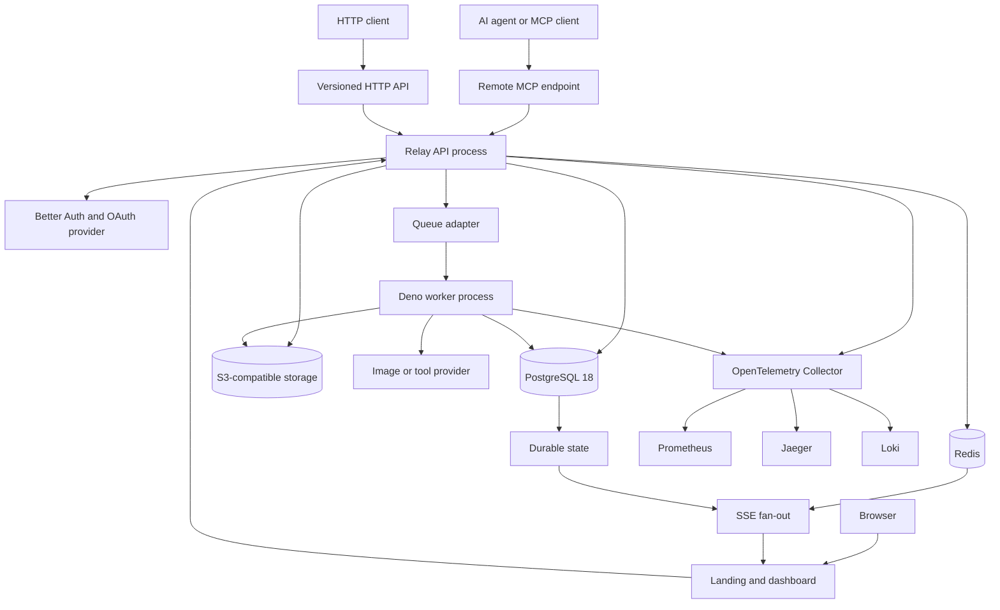
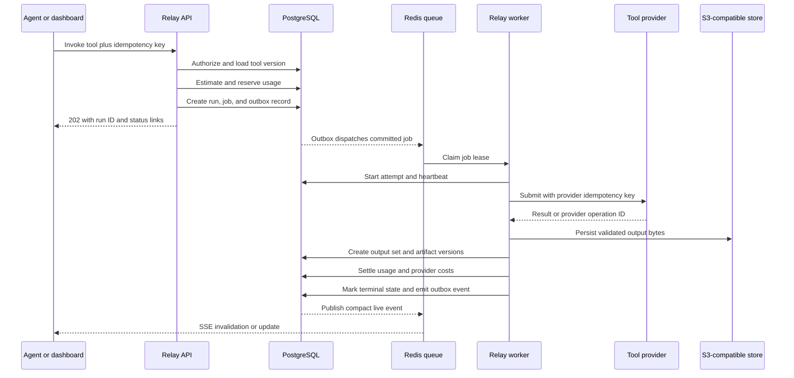

# Relay product, architecture, and roadmap

Status: canonical product and architecture direction\
Last updated: 2026-08-20\
Product: Relay by ZafTech\
Planned domain: `https://relay.zaftech.co`

## Authority and scope

This document is the current source of truth for Relay's product model,
architecture boundaries, delivery sequence, and approved future direction.

When another planning document conflicts with this one, this document wins for
product scope and system behavior. Specialized documents remain authoritative
for their narrower subjects:

- [`versioning.md`](versioning.md) for the release-versioning proposal
- [`changelog.md`](changelog.md) for changelog publication
- [`legal.md`](legal.md) for legal-page integration and launch review
- [`brand.md`](brand.md) for voice and visual direction
- [`implementation-status.md`](implementation-status.md) for what exists in the
  repository today

The design handoffs are visual references, not product-contract authorities.
They must be reconciled with this document before frontend implementation.

## Product definition

Relay is a curated tool and artifact registry for AI agents.

Agents discover a supported tool, invoke it, observe durable execution state,
and receive one or more persisted artifacts with Relay-managed URLs. Work that
may be slow, expensive, or externally executed runs asynchronously. Every
invocation is accounted for, even when its customer price is zero.

The core product model is:

```text
Tool definition and version
  -> Tool run
  -> Background job and attempts, when asynchronous
  -> Durable output set and artifact versions
  -> Managed share or download URL
  -> Usage settlement and provider-cost reconciliation
```

The initial catalog focuses on multiple image-generation providers and models.
The same boundaries must later support document conversion, rendering,
transcription, archive creation, and other agent-oriented tools without turning
Relay into an arbitrary-code platform.

## Product promise

Relay gives an AI agent a reliable answer to five questions:

1. What tools may I call?
2. What inputs, outputs, limits, and cost model does each tool have?
3. What is happening with my invocation now?
4. Where are the durable outputs?
5. What was consumed, charged, retried, or released?

A concise product statement is:

> Call the tool. Track the work. Share the result.

Relay is not merely object storage with an MCP wrapper. Storage is a durable
substrate for tool outputs, uploaded inputs, versions, and managed delivery.

## Goals

- Publish a curated, versioned catalog of tools with machine-readable contracts.
- Expose those tools through remote MCP, a versioned HTTP API, and a dashboard.
- Execute long-running and provider-backed tools outside request handlers.
- Persist authoritative run, attempt, progress, and terminal-result state.
- Store every durable output through a provider-neutral S3 adapter.
- Return stable Relay resource identities and managed delivery URLs rather than
  treating provider URLs as durable results.
- Support one-to-many outputs and provenance between inputs, runs, and
  artifacts.
- Meter work through estimate, reservation, and settlement stages.
- Keep customer usage accounting separate from upstream provider costs.
- Make feature gating, limits, subscriptions, and plan changes additive.
- Preserve workspace isolation and auditability from the first release.
- Provide live dashboard updates through Server-Sent Events (SSE).
- Emit metrics, traces, and structured logs through OpenTelemetry.
- Deploy stateless application containers against independently managed
  PostgreSQL, Redis, S3-compatible storage, and observability services.

## Explicit MVP non-goals

- User-uploaded executable tools or arbitrary code execution
- A public tool marketplace
- General workflow graphs or a visual automation builder
- Streaming uploads, downloads, or generation output
- Multi-region execution or active-active failover
- Kubernetes
- Hidden cross-provider fallback that can change cost or output semantics
- Permanent public S3 objects or durable dependence on provider result URLs
- A consumer cloud-drive experience
- Per-workspace bring-your-own S3 credentials
- General document transformation beyond the first deliberately selected tools
- Marker integration or distribution of Marker model weights

## Actors and personas

| Actor                  | Primary need                                        | Important constraints                                                |
| ---------------------- | --------------------------------------------------- | -------------------------------------------------------------------- |
| AI agent or MCP client | Discover, invoke, and check tools; retrieve outputs | Stable schemas, idempotency, structured errors, bounded polling      |
| Workspace member       | Run tools and inspect permitted artifacts           | Clear limits, provenance, useful failure recovery                    |
| Workspace admin        | Manage access, tokens, retention, and usage         | Audited changes and workspace-scoped authorization                   |
| Workspace owner        | Control the workspace and commercial relationship   | Last-owner protection and billing visibility                         |
| System superadmin      | Curate tools and publish changelog entries          | Separate platform role, fresh authentication, complete audit trail   |
| Relay operator         | Diagnose availability, queues, costs, and incidents | Low-cardinality telemetry and actionable run history                 |
| Execution provider     | Perform generation or transformation                | Adapter isolation, idempotency, rate limits, and cost reconciliation |

## Domain glossary

| Term                | Canonical meaning                                                                                                                                                                                                                                |
| ------------------- | ------------------------------------------------------------------------------------------------------------------------------------------------------------------------------------------------------------------------------------------------ |
| Tool                | A stable, curated capability that Relay exposes to agents. A tool has a stable key, human description, typed contract, lifecycle, and one active version per compatibility line.                                                                 |
| Tool version        | An immutable snapshot of a tool contract and implementation binding: input schema, output schema, execution policy, meter policy, handler key, and compatibility metadata.                                                                       |
| Provider            | An external service or internal execution engine that performs work for a tool. Provider SDK types never enter public contracts.                                                                                                                 |
| Provider model      | A provider-specific model or engine with capabilities, availability, pricing inputs, and retirement state. A tool version may bind to one or more approved provider models.                                                                      |
| Tool run            | The durable, user-visible record of one accepted invocation. Every execution has a run, including an immediate execution.                                                                                                                        |
| Job                 | The queued execution record for an asynchronous run. In the MVP, an asynchronous run has one logical job.                                                                                                                                        |
| Attempt             | One claim or recovery segment within a job. Attempts record submission certainty, provider request identity, timing, outcome, and retry classification.                                                                                          |
| Artifact            | A workspace-owned logical output or uploaded input whose identity remains stable across revisions.                                                                                                                                               |
| Artifact version    | An immutable stored representation and metadata snapshot for an artifact. Generated outputs normally create a new artifact at version one; transformations may create a new derived artifact or append a version according to the tool contract. |
| Output set          | The ordered, named collection of outputs produced by one run. It supports zero, one, or many artifacts and per-output status.                                                                                                                    |
| Share link          | A revocable Relay resource that resolves an artifact or pinned artifact version under an access policy. It is distinct from a short-lived S3 signature.                                                                                          |
| Usage estimate      | A pre-execution projection or range using the selected tool, model, inputs, and current pricing policy. It is not a settled charge.                                                                                                              |
| Usage reservation   | Capacity held atomically before work is queued so concurrent runs cannot overspend the same allowance.                                                                                                                                           |
| Usage event         | An append-only settled customer-usage record with a unique idempotency key. Adjustments are new events, not edits.                                                                                                                               |
| Provider-cost event | An internal append-only record of upstream consumption or currency cost. It is reconciled separately from customer usage.                                                                                                                        |
| Entitlement         | A workspace capability or limit, independent of plan display names and operational feature flags.                                                                                                                                                |
| Workspace           | The product term for a Better Auth organization and the authorization boundary for user-owned records.                                                                                                                                           |

## Product invariants

These rules are architectural, not implementation suggestions:

1. PostgreSQL is the durable source of truth for catalog, run, artifact,
   metering, authorization, and audit state.
2. Redis may transport queue work and live events, but is never the only record
   of user-visible job status.
3. Object storage owns bytes. PostgreSQL owns identity, ownership, state,
   provenance, and policy.
4. A durable result stores Relay IDs, not expiring provider or S3 URLs.
5. Every provider-backed generation or transformation runs asynchronously.
6. Every execution creates a durable tool run and an idempotent accounting path.
7. Retrying never blindly repeats a provider submission whose outcome is
   unknown.
8. Tool implementations are code-first. The database controls publication,
   metadata, availability, versions, provider bindings, and entitlement policy.
9. No client-supplied workspace ID is trusted without membership and resource
   authorization checks.
10. Feature flags, entitlements, reservations, usage, provider costs, and
    subscriptions remain separate concepts.
11. Public changelog content is reviewed and database-published; raw Git commits
    are never customer-facing release notes.

## System context

Relay uses a modular monolith with independently running API and worker
processes from one source revision and one application image.



### Application processes

The compiled executable dispatches by command:

```text
relay api
relay worker
```

The API and workers share domain contracts but have independent scaling,
shutdown, and failure boundaries. Separate provider-specific worker images are
allowed later when native dependencies justify them; the system does not split
into a microservice per tool by default.

### Technology direction

| Concern                | Direction                                                                                                                                        |
| ---------------------- | ------------------------------------------------------------------------------------------------------------------------------------------------ |
| Runtime                | Deno 2, compiled for production                                                                                                                  |
| HTTP                   | Hono                                                                                                                                             |
| Web                    | React and Vite under `apps/web`; final implementation waits for an approved revised design handoff                                               |
| MCP                    | Official MCP TypeScript SDK with Streamable HTTP                                                                                                 |
| Browser auth           | Better Auth with Google and GitHub                                                                                                               |
| MCP authorization      | Better Auth OAuth 2.1 Provider and resource-server support; do not use the deprecated Better Auth MCP plugin                                     |
| Tenancy                | Better Auth organizations exposed as Relay workspaces                                                                                            |
| Database               | PostgreSQL 18                                                                                                                                    |
| Cache and coordination | Redis                                                                                                                                            |
| Queue                  | Deno/TypeScript queue adapter; implementation selected only after enqueue, retry, cancellation, shutdown, and `deno compile` compatibility tests |
| Object storage         | Generic S3-compatible adapter supporting MinIO, R2, AWS S3, and equivalents                                                                      |
| Live dashboard         | Workspace-scoped SSE with durable HTTP resynchronization                                                                                         |
| Telemetry              | OpenTelemetry collector feeding Prometheus, Jaeger, and Loki                                                                                     |
| Packaging              | One stateless application image containing the compiled executable and built web assets                                                          |

RQ is not used: it executes Python function references in Python workers and is
not a compatible queue contract for an all-Deno worker implementation.

### Infrastructure ownership

PostgreSQL, Redis, MinIO or another S3 service, Prometheus, Loki, Jaeger, and
the OpenTelemetry collector are deployed independently from Relay's Compose
project. Application containers remain stateless.

The MVP uses one deployment-configured S3-compatible backend. Storage provider
configuration is an infrastructure concern, not a workspace setting. A future
bring-your-own-storage feature must be introduced as a separately secured and
metered capability.

## Data ownership

| Store                 | Durable responsibilities                                                                                                                                                                                                                                                                    |
| --------------------- | ------------------------------------------------------------------------------------------------------------------------------------------------------------------------------------------------------------------------------------------------------------------------------------------- |
| PostgreSQL            | Users, sessions, OAuth clients and consent; workspaces and roles; tool catalog and versions; provider/model metadata; runs, jobs, attempts, output sets; artifacts and versions; share links; entitlements, reservations, usage, provider costs; changelog; audit; legal acceptance; outbox |
| Redis                 | Queue transport, leases, rate limits, short-lived cache, SSE fan-out, optional locks, Better Auth secondary storage where appropriate                                                                                                                                                       |
| S3-compatible storage | Input and output bytes under immutable server-generated object keys                                                                                                                                                                                                                         |

Object storage configuration supports endpoint, region, bucket, credentials,
path-style addressing, TLS behavior, signature lifetime, and an optional CDN or
public resolver base. Provider-specific SDK objects and URLs do not cross the
storage adapter.

## Tool registry

### Code-first implementation, data-driven publication

Relay does not execute code uploaded through the dashboard. A tool handler is
reviewed source code shipped with Relay or with a separately controlled worker
image.

The database controls:

- Stable tool key and public name
- Description, category, icon, examples, and search metadata
- Tool version and immutable input/output schemas
- Handler key and execution mode
- Approved provider/model bindings
- Availability by environment and workspace
- Meter definition and estimate rules
- Entitlement requirements and concurrency limits
- Publication, deprecation, disablement, and retirement state

This split permits operators to disable a provider or deprecate a version
without deploying, while preventing database content from becoming executable
code.

### Lifecycle

A tool version follows this publication lifecycle:

```text
draft -> internal -> published -> deprecated -> retired
                      |              |
                      +-> disabled <-+
```

- `draft`: editable and unavailable to clients.
- `internal`: available only to authorized testers or feature flags.
- `published`: discoverable and callable when entitlements permit.
- `deprecated`: callable during its compatibility window but excluded from
  default recommendations.
- `disabled`: temporarily unavailable because of incidents, safety, provider,
  cost, or policy concerns.
- `retired`: no new runs accepted; historical runs and artifacts remain
  inspectable.

Publishing, disabling, deprecating, changing provider routing, and retiring a
tool create audit events. Published tool versions are immutable; a change
creates a new version.

### Compatibility

Prefer additive schema evolution. A stable MCP tool name remains unchanged for
compatible versions. An unavoidable breaking contract receives a replacement
tool name or suffix and a measured deprecation window; a database version number
alone must never silently reinterpret client input.

Provider models have an independent lifecycle. A provider model can be disabled
without changing the public tool contract when another binding has equivalent
semantics and the routing policy explicitly permits it. Relay must not silently
fallback when doing so can materially change output, safety behavior, latency,
or cost.

## Execution model

### Immediate and asynchronous work

Every accepted executable tool invocation creates a tool-run record.

- Provider calls, image generation, transformations, remote ingestion, and any
  operation with unbounded or material duration are asynchronous jobs.
- Millisecond control-plane operations such as listing tools, reading a run, or
  creating a share-link policy remain synchronous. They are authorized,
  rate-limited, audited where needed, and may be recorded as immediate runs when
  they are themselves catalog tools.
- A handler may not switch between immediate and asynchronous behavior without a
  versioned contract change.

### Asynchronous acceptance flow



The API transaction must not report acceptance unless it has durable run,
reservation, and dispatch intent. A transactional outbox prevents a successful
database commit from being stranded by a transient queue failure.

### Idempotency

- Every mutating HTTP or MCP invocation accepts or derives an idempotency key.
- The uniqueness scope includes workspace, tool version, actor/client, and key.
- Repeating a request returns the original run when the contract and payload
  match.
- Reusing a key with a different payload returns a typed conflict.
- Queue delivery is at least once. Handlers must make every state transition and
  side effect idempotent.

## Runs, jobs, attempts, and retries

### Job states

The MVP job state set is:

```text
queued
running
succeeded
failed
cancel_requested
cancelled
```

A run may expose the same execution state plus output completeness. Partial
multi-output success is represented by per-output status and an explicit
`partial` result marker, not by pretending every requested output succeeded.

A job stores input and handler schema versions, app version, idempotency key,
progress, attempt count, lease and heartbeat times, terminal result IDs, and a
sanitized error. Attempt records preserve detailed retry evidence.

### Progress

Progress is structured and monotonic within an attempt:

```json
{
  "current": 2,
  "total": 4,
  "percentage": 50,
  "stage": "persisting_outputs",
  "message": "Saving generated images"
}
```

Stages are stable machine values; messages are user-facing and may evolve.
Progress is never the durable result.

### Retry classification

Retries are allowed only when the failure is classified and the next action is
safe:

| Failure point                                               | Required behavior                                                                                                                                               |
| ----------------------------------------------------------- | --------------------------------------------------------------------------------------------------------------------------------------------------------------- |
| Before provider submission                                  | Retry with the same Relay and provider idempotency keys.                                                                                                        |
| Provider submission confirmed                               | Persist the provider operation ID. Poll or retrieve; do not submit again.                                                                                       |
| Submission outcome ambiguous                                | Reconcile using the provider idempotency key or operation lookup. Never blindly resubmit. Escalate to a typed unresolved state if reconciliation is impossible. |
| Provider completed; retrieval failed                        | Retry retrieval against the same provider result.                                                                                                               |
| Output retrieved; storage failed                            | Retry persistence of captured output where retention permits. Do not regenerate solely because S3 failed.                                                       |
| Deterministic validation, policy, safety, or schema failure | Do not auto-retry. Return a corrective action.                                                                                                                  |
| Transient provider, network, or rate-limit failure          | Retry with bounded exponential backoff, jitter, provider hints, and a hard deadline.                                                                            |

Cancellation is cooperative. `cancel_requested` is visible while Relay asks the
worker or provider to stop. A late cancellation may resolve as `succeeded` when
the provider completed first; the audit record must show the race.

Workers heartbeat long operations, recover stale leases, stop claiming work on
`SIGTERM`, finish or checkpoint within a grace period, and preserve trace
context across queue delivery.

## Artifact and storage model

### Artifact identity

An artifact is a first-class product resource, not a provider response. Each
artifact has immutable versions under server-generated object keys. Typical
fields include:

```text
artifacts
  id
  workspace_id
  name
  media_kind
  current_version_id
  source_run_id nullable
  created_by
  retention_policy
  deleted_at

artifact_versions
  id
  artifact_id
  sequence
  object_key
  storage_version_id nullable
  sha256
  etag
  size_bytes
  mime_type
  width nullable
  height nullable
  duration_ms nullable
  source
  source_run_id nullable
  parent_version_id nullable
  metadata
  created_at
```

Rules:

- Never overwrite an existing object key.
- Enforce unique artifact sequences and optimistic current-version changes.
- Treat MIME type, filename, dimensions, and provider metadata as untrusted
  until verified.
- Record native S3 version IDs when available but do not depend on bucket
  versioning.
- Restore an old version by creating a new head version.
- Soft-delete first and purge asynchronously according to retention policy.
- Keep generated prompts and provider metadata under an explicit privacy and
  retention policy; do not expose them by default through share links.

### Output sets

One run may produce multiple named outputs. An output set records ordering,
requested count, produced count, per-output status, artifact-version IDs, and
warnings. A missing output does not erase successful siblings.

### Uploads

Direct uploads use a create, upload, and complete flow. Normal file bytes do not
pass through the API:

1. Create a pending artifact version.
2. Return a short-lived presigned PUT URL.
3. Upload directly to S3-compatible storage.
4. Complete the upload.
5. Verify object existence, expected size, and checksum where supported.
6. Mark the version available.

### Managed delivery and share links

Relay distinguishes three identities:

1. The durable artifact or artifact-version ID.
2. A durable Relay share-link resource with policy and a hashed secret token.
3. A short-lived S3 GET signature created only when bytes are delivered.

A share link can be pinned to one immutable version or follow the current
version. Its policy may include expiration, revocation, authentication, download
limit, content disposition, and later domain restrictions. The public URL should
resolve on a Relay-controlled host; `/s/{token}` is the proposed path until
routing is finalized.

Revoking a Relay link stops future resolutions. It cannot retroactively revoke a
previously issued S3 signature, so signatures remain short-lived and UI copy
must not claim immediate revocation of already issued bearer URLs.

## Image-generation catalog

### Initial scope

The first production tool family is image generation across multiple approved
providers and models. Relay should deliver one provider as a complete vertical
slice before adding more adapters, but the catalog, contracts, and ledger must
support multiple providers from the start.

A catalog entry presents:

- Tool and tool-version identity
- Provider/model identity or an explicit routing policy
- Supported modalities and reference-image behavior
- Input schema and defaults
- Output count, media types, dimensions, and limits
- Safety and moderation behavior
- Expected latency band
- Meter unit, estimated use, and reservation policy
- Availability, deprecation, and regional constraints
- Representative generated outputs with provenance

### Provider adapter

The worker-facing abstraction should support the provider's real lifecycle
rather than assume every API is synchronous:

```text
ImageProvider
  capabilities
  estimate
  submit
  inspect
  retrieve
  cancel
  normalizeError
  normalizeUsage
```

A shared input core may include prompt, negative prompt, dimensions or aspect
ratio, output count, seed, quality, and reference-artifact IDs.
Provider-specific options live in a namespaced, schema-validated field so Relay
does not reduce all providers to a false lowest common denominator.

Provider credentials are worker-only secrets. Provider request IDs, model
versions, revised prompts when returned, safety decisions, seed, and normalized
usage are persisted as protected provenance. Provider URLs are temporary inputs
to ingestion and never become Relay's durable result.

Fallback or model substitution is opt-in and policy-driven. It must be visible
in the run record and estimate because it can alter output, cost, latency,
safety, and reproducibility.

## Metering, entitlements, and subscriptions

### Separation of concerns

- Feature flags control rollout and operational exposure.
- Entitlements state whether a workspace can use a capability and its limits.
- Usage reservations prevent concurrent overspend.
- Usage events record settled customer consumption.
- Provider-cost events record upstream consumption and money.
- Subscriptions and grants explain why entitlements exist.
- Plan display names never appear in core authorization conditions.

Application code asks a service such as:

```text
can(workspace, capability)
limit(workspace, metric)
estimate(toolVersion, inputs, providerModel)
reserve(workspace, estimate, idempotencyKey)
settle(reservation, actualUsage)
```

### Lifecycle

For asynchronous work:

1. Verify identity, workspace membership, scope, tool availability, and
   entitlement.
2. Calculate a point estimate or bounded range and show its unit and
   assumptions.
3. Atomically reserve the conservative amount.
4. Create the run and queue intent in the same durable transaction.
5. Record provider costs as attempts execute.
6. Commit actual customer usage at the tool version's settlement point.
7. Release unused reservation on success, failure, timeout, or cancellation.
8. Emit compensating events for later corrections; never edit settled history.

Every reservation and event has a unique idempotency key. Pricing and meter
rules are versioned so historical runs can be explained after a catalog change.

### Retry and failure policy

Provider cost and customer charge are separate decisions. Relay records actual
upstream consumption even when a customer retry is free. The tool version
specifies customer settlement for validation rejection, safety rejection,
provider failure, partial output, retry, cancellation, and storage failure.
Those policies must be visible before execution and included in the run receipt.

### Future subscriptions

A billing provider can be added without rewriting authorization. Subscriptions
map external states into internal subscription and entitlement-grant records.
Catalog versions or entitlement snapshots preserve historical plan behavior.

## HTTP and MCP contracts

### Common contract rules

HTTP, MCP, and dashboard actions call the same application services. They share:

- Workspace authorization
- Tool and schema resolution
- Idempotency behavior
- Entitlement and reservation checks
- Structured error codes
- Run and artifact identities
- Audit and telemetry context

No interface is allowed to bypass metering or authorization.

### HTTP shape

External HTTP routes live under `/api/v1`. The initial resource shape is:

```text
GET  /api/v1/tools
GET  /api/v1/tools/:toolKey
POST /api/v1/tools/:toolKey/estimate
POST /api/v1/tool-runs
GET  /api/v1/tool-runs
GET  /api/v1/tool-runs/:runId
POST /api/v1/tool-runs/:runId/cancel
GET  /api/v1/artifacts
GET  /api/v1/artifacts/:artifactId
GET  /api/v1/artifacts/:artifactId/versions
POST /api/v1/artifacts/uploads
POST /api/v1/artifacts/uploads/:uploadId/complete
POST /api/v1/share-links
DELETE /api/v1/share-links/:shareLinkId
GET  /api/v1/usage
GET  /api/v1/events
```

These paths express the resource model, not a frozen route specification. The
OpenAPI contract and implementation tests become authoritative before public
release. Mutating requests use idempotency keys. Asynchronous acceptance returns
`202` with run ID, current state, status URL, and any reservation summary.

### MCP shape

The remote MCP server uses Streamable HTTP at `/mcp` and Better Auth OAuth 2.1
protected-resource metadata.

Relay should advertise active curated tools as typed MCP tools so an agent can
see each tool's real schema. Management tools remain stable across the catalog,
for example:

```text
relay.tools.list
relay.tools.get
relay.runs.get
relay.runs.list
relay.runs.cancel
relay.artifacts.get
relay.artifacts.list
relay.artifacts.create_upload
relay.artifacts.create_share_link
relay.artifacts.revoke_share_link
```

Exact executable tool names are chosen with the first provider contracts. A
generic raw-JSON executor must not be the only interface to image generators.

A successful asynchronous tool call returns structured data containing the run
ID, state, estimate or reservation summary, and status-check guidance. A
completed status response contains output-set and artifact IDs plus freshly
resolved managed URLs when authorized. Text content remains concise; structured
content is canonical for agents.

Initial OAuth scopes should follow the new resource model:

```text
openid
profile
email
offline_access
tools:read
tools:execute
runs:read
runs:cancel
artifacts:read
artifacts:write
artifacts:share
usage:read
```

Scopes are necessary but never replace workspace membership, resource ownership,
tool availability, entitlement, quota, or policy checks.

## Authentication and authorization

Google and GitHub are upstream browser identity providers. Relay requests only
identity scopes needed for sign-in. Better Auth manages browser sessions,
workspaces, OAuth clients, consent, and access tokens for MCP clients.

Use Better Auth's OAuth Provider package and protected-resource support. Do not
build a new integration on the deprecated MCP plugin. Validate access-token
signature, issuer, audience, expiry, scopes, client identity, and revocation
behavior according to the selected token format.

Every user receives a personal workspace. Team invitations and workspace
switching may be hidden initially, but the data model and authorization boundary
exist from the start.

Workspace roles are:

```text
owner
admin
member
```

`superadmin` is a separate system-level role. It is never a workspace role.

Session cookies remain host-only to `relay.zaftech.co` unless a separately
reviewed central ZafTech login is introduced. OAuth provider tokens are
encrypted at rest. Account linking requires verified provider data and an
explicit policy.

## Security and governance

Minimum controls:

- HTTPS for every production endpoint
- High-entropy Better Auth secret and exact trusted origins
- Secure, HTTP-only cookies and reviewed proxy-header trust
- Hashed API keys, OAuth client secrets, and share-link tokens
- Encrypted social and execution-provider credentials
- Rate limits for auth, OAuth registration, MCP, URL creation, and expensive
  tools
- Server-generated object keys and short S3 signature lifetimes
- File-size, content-type, checksum, storage, egress, run, and concurrency
  limits
- Strict remote-fetch allowlists and SSRF controls when URL inputs arrive
- Prompt, file, and output content excluded from logs and traces by default
- Provider safety decisions normalized without exposing unsafe raw payloads
- Workspace predicates on every query and mutation
- Sanitized public errors with detailed operator evidence in protected
  logs/traces
- Test-only Better Auth utilities excluded from production configuration
- Audit events for tool publication, provider routing, key changes, share links,
  artifact deletion, role changes, entitlement changes, and changelog
  publication

Company-wide legal pages remain canonical on `zaftech.co`. Relay needs a
reviewed product addendum covering stored inputs and outputs, prompts, provider
subprocessors, retention, sharing, usage consumption, safety handling, and
refund implications. Legal acceptance records store document version and content
hash.

## Live updates

The dashboard first reads durable state over HTTP, then opens one
workspace-scoped SSE connection. Events contain compact changes or invalidation
hints. On reconnect, the client refetches authoritative PostgreSQL-backed state.

Redis Pub/Sub may distribute events among API instances but is not durable.
Important events originate in the transactional outbox. Missing a live event is
recoverable; losing durable state is not.

MCP clients check status with run tools. Their polling behavior is independent
from dashboard SSE and should honor server guidance and rate limits.

## Observability

API and worker processes emit OpenTelemetry data to the independently deployed
collector.

### Metrics

Initial low-cardinality metrics include:

- HTTP and MCP request count, duration, and errors
- Queue depth and oldest queued-run age
- Run and attempt duration, failure, retry, cancellation, and stale lease counts
- Provider submission, retrieval, rate-limit, safety, and cost outcomes
- Artifact bytes stored, uploaded, generated, downloaded, and purged
- S3 latency and error rates
- SSE connection and reconnect counts
- Entitlement denials, reservation contention, and quota exhaustion
- Usage-settlement lag and unreconciled provider-cost events

Never use user IDs, workspace IDs, run IDs, artifact IDs, prompts, object keys,
or URLs as Prometheus labels.

### Traces

Trace context flows through:

```text
MCP or HTTP request
  -> authorization and reservation
  -> PostgreSQL transaction and outbox
  -> queue enqueue and worker claim
  -> provider submission or retrieval
  -> object storage
  -> usage settlement and live event
```

### Logs

Structured logs include service, environment, app version, Git revision, trace
and span IDs, workspace and run IDs where policy permits, tool key, tool
version, provider, model, attempt, and normalized error code. Logs never contain
secrets, bearer tokens, signed URLs, file contents, or full prompts by default.

Audit events are not ordinary logs. They are durable application records with
actor, action, target, before/after facts, request and trace identity,
timestamp, and outcome.

## Versioning

Relay has independent version dimensions:

- Product release SemVer and Git revision
- HTTP API path version
- MCP tool contract and tool-version identity
- Background payload schema and handler version
- Database migration identifier
- Artifact and artifact-version identity
- Provider/model and pricing-policy snapshots
- Legal document version and content hash
- Entitlement catalog or grant version
- Changelog revision

These dimensions do not share one counter. API and worker images normally ship
from the same product release. See [`versioning.md`](versioning.md) for the
proposed pre-1.0 SemVer and tag policy; it remains a release-process decision
until explicitly approved.

Runtime build information is exposed through `/version`, health responses, MCP
`serverInfo`, dashboard diagnostics, logs, traces, and a low-cardinality build
metric.

## Changelog

Relay uses a Git-assisted, database-published changelog:

1. A release tag and commit SHA identify source.
2. CI or a superadmin creates a draft.
3. A system superadmin edits and previews user-facing content.
4. Publication records an audited revision in PostgreSQL.
5. The landing page, `/changelog`, feed, and public API show only published
   entries.

Raw commits are never rendered directly. See [`changelog.md`](changelog.md).

## CI, packaging, and deployment

### Pull requests to `main`

CI should run targeted formatting, lint, type checks, unit tests, integration
tests with disposable PostgreSQL/Redis/MinIO, auth tests, migration tests,
compiled-runtime smoke tests, frontend tests, container build, and dependency
and image scanning.

### Merge to `main`

CD builds once and pushes Docker Hub tags for the immutable Git SHA and the
chosen moving tags such as `main` or `latest`. Official SemVer tags are
published only by the release process.

### VPS deployment

Infrastructure remains external. The preferred zero-surprise sequence is:

```sh
docker compose pull
docker compose run --rm migrate
docker compose up -d --remove-orphans
```

The user's existing
`docker compose down -v && docker compose pull && docker
compose up -d` does not
remove independently managed infrastructure volumes, but `down -v` is
unnecessary, creates downtime, and could remove future application-owned
volumes. Production should pin a release or immutable SHA for deterministic
rollback.

Readiness must check required dependencies and migration compatibility without
mutating them. Liveness only proves the process can respond.

## Delivery plan and test gates

The order below preserves the agreed implementation sequence while avoiding a
large untestable branch.

### Milestone 0 — Canonical contract and scaffold hardening

- Approve this product model and the revised design-agent backlog.
- Fix the Dockerfile and make repository-wide checks ignore or normalize design
  exports deliberately.
- Choose the database/migration layer and queue adapter through compiled-runtime
  spikes.
- Define test fixtures and local disposable infrastructure.

Gate: targeted source checks, container build, and a compiled API/worker smoke
test pass.

### Milestone 1 — Landing, authentication, and one protected page

Implement together:

- Revised corporate landing page
- Google and GitHub sign-in
- Better Auth PostgreSQL schema and personal workspace creation
- `/dashboard` protected shell and one useful authenticated overview
- Session expiry, provider failure, and unauthorized-route states

Frontend work is blocked until a design handoff aligned with this document is
approved. The existing Ledger visual foundation may be reused, but the
storage-first IA and copy may not.

Gate: unit and integration tests for auth callbacks and workspace creation;
browser tests for landing, sign-in, session protection, and responsive behavior;
accessibility checks for representative states.

### Milestone 2 — Changelog, telemetry, audit, and CI/CD

- Git-assisted, superadmin-published changelog
- OpenTelemetry bootstrap for API and worker
- Durable audit-event service
- PR CI and merge-to-Docker-Hub CD
- Build metadata and migration command

Gate: changelog authorization/publication tests, trace/log correlation test,
audit immutability tests, CI dry run, container publish and pull smoke test.

### Milestone 3 — Registry, artifacts, and storage

- Tool, tool-version, provider, and provider-model schema
- Superadmin curation service without arbitrary code upload
- S3 adapter and direct upload completion
- Artifact, artifact-version, output-set, and share-link schema
- Managed URL resolver
- Catalog and artifact dashboard foundations

Gate: migration tests, workspace-isolation tests, S3 contract tests against
MinIO, share-link revocation/expiry tests, and catalog lifecycle tests.

### Milestone 4 — Durable execution and metering

- Queue adapter and transactional outbox
- Runs, jobs, attempts, heartbeats, leases, retries, cancellation, and timeouts
- Estimate, reservation, settlement, and provider-cost ledgers
- Workspace-scoped SSE
- Job and usage dashboard surfaces

Gate: at-least-once and idempotency tests, crash/recovery tests, ambiguous
submission simulations, quota concurrency tests, cancellation races, SSE
reconnect/resync tests, and compiled worker tests.

### Milestone 5 — First image tool vertical slice

- One production image provider and model
- Typed HTTP and MCP tool contract
- Schema-driven run composer
- Generated-output ingestion and image metadata validation
- Multi-output artifact result
- Estimate and final usage receipt
- Provider, storage, safety, rate-limit, partial-output, and timeout states

Gate: provider contract tests with recorded or official sandbox responses; E2E
MCP invocation through completed artifact and managed URL; metering
reconciliation; browser golden path; no secrets or prompts in telemetry.

### Milestone 6 — Multi-provider catalog

- Add second and subsequent providers through the proven adapter
- Provider/model capability matrix
- Explicit routing and fallback policy
- Per-tool/provider/model usage views
- Provider health and curation controls
- Representative generated-image assets for product and docs

Gate: cross-provider contract suite, model retirement test, explicit-routing and
no-silent-fallback tests, cost reconciliation, and design review using real
outputs.

### Milestone 7 — Beta hardening and 1.0 preparation

- Backup and restore rehearsal
- Retention and purge verification
- Incident and operational runbooks
- Public compatibility and deprecation policy
- Legal addendum and subprocessor review
- Subscription integration when commercially required
- Security review and abuse controls

Gate: recovery exercise, load and failure testing, release rollback, legal
signoff, and the criteria in `versioning.md`.

## Parallel development boundaries

Work can be split into worktrees once contracts are agreed:

| Workstream                 | Owns                                                           | Depends on                               |
| -------------------------- | -------------------------------------------------------------- | ---------------------------------------- |
| Web and auth               | `apps/web`, auth pages, protected shell, browser tests         | Approved design, auth/database contracts |
| Database and domain        | Migrations, repositories, catalog/artifact/run models          | Canonical glossary and IDs               |
| Storage                    | S3 adapter, upload completion, artifact ingestion, MinIO tests | Artifact contracts                       |
| Queue and worker           | Queue adapter, leases, attempts, shutdown, recovery tests      | Run/job contracts and database           |
| MCP and HTTP               | Transport adapters, schemas, errors, idempotency               | Application services and auth            |
| Metering                   | Estimate, reservation, usage, provider-cost ledgers            | Tool versions and run lifecycle          |
| Observability and delivery | OpenTelemetry, CI/CD, image build, runbooks                    | Stable process entry points              |
| Changelog and governance   | Draft/publish flow, superadmin, audit                          | Auth and database                        |

Worktrees must not invent overlapping schemas. Contract and migration ownership
is centralized, and integration occurs milestone by milestone with tests before
the next layer begins.

## Future capabilities

The approved architecture deliberately leaves room for:

- Document conversion and rendering
- OCR and structured extraction using commercially compatible engines
- Spreadsheet parsing and validation
- PDF, slide, and webpage rendering
- Audio transcription and speech generation
- Video rendering and media transcoding in capability-specific worker images
- Archive creation, inspection, and verification
- URL ingestion with strict SSRF controls
- Webhooks and callbacks backed by the outbox
- Streaming inputs and outputs after explicit protocol and billing design
- Artifact-derived previews, thumbnails, and transformations
- Content-addressed blob deduplication
- Per-workspace retention and residency policies
- Bring-your-own storage
- Team management and paid subscriptions
- Provider routing based on capability, region, latency, or budget
- Multi-region control and execution planes
- A reviewed third-party tool ecosystem only after sandboxing, signing,
  provenance, permissions, abuse, and billing models exist

Each future tool still follows the same chain: published contract, authorized
run, durable execution evidence, persisted artifacts, managed delivery, and
meter settlement.

## Open decisions

These choices remain implementation decisions rather than settled product facts:

- Database query builder and migration tool
- Queue implementation after the Deno compiled-runtime spike
- First and second image providers and models
- Exact executable MCP tool names
- Exact public share-link path and default expiration policy
- Customer settlement policy for partial outputs and provider-charged failures
- Initial entitlement catalog and quota values
- Paddle or another billing-provider integration timing
- Public tool-contract deprecation window
- Product SemVer release automation and who creates official tags
- Whether the web build is embedded into the executable or copied beside it in
  the same image

Open decisions must not change the invariants in this document without an
explicit architecture update.
